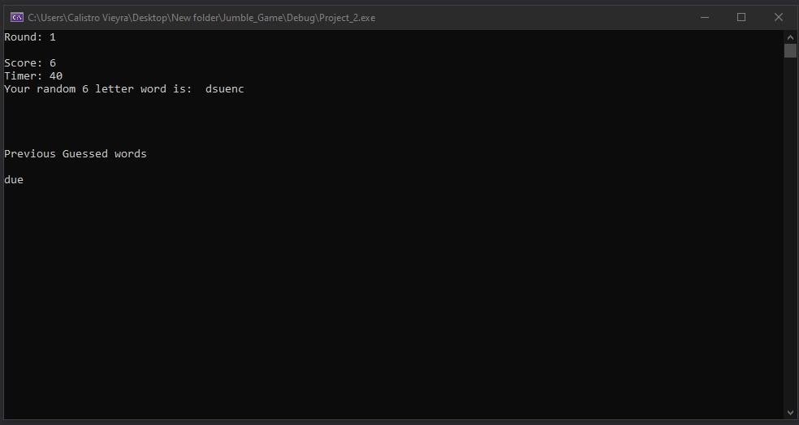

# Jumble_Game

•	This jumble game I coded will begin by reading in a .txt file filled with over 110,000 words. These words will be used to validate against the players guesses and will be presented to the player in a scrambled manner.

•	The game begins by reading in each word and storing them into a hash table that I also wrote and integrated.

•	If a new high score is reached the player can choose to save it and the game will automatically create a “HighScores.txt” file inside the “Project_2” folder.

•	The game will automatically read the “HighScores.txt” file and display the score on the screen with option 2 in the main menu.

Rules:

•	You will have 60 seconds to guess the right word to continue to the next round.

•	Make as many guesses as you can in the time frame to increase the possibility of guessing the correct word.

•	Guessing other words stored in my dictionary will also give you points.
